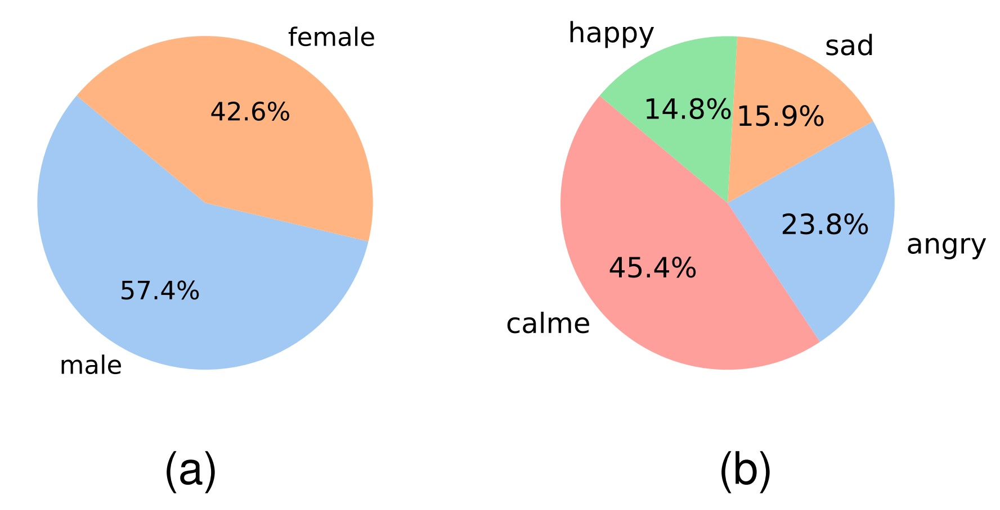
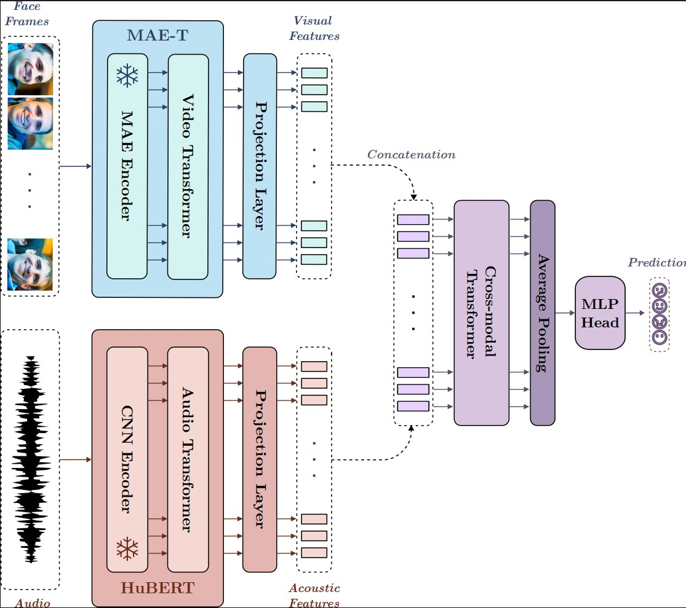

# MERT & EMAD: Multimodal Emotion Recognition for Moroccan Arabic - Darija

This repository contains and code for our MERT & EMAD paper.

## EMAD (Emotional Moroccan Arabic Dataset)

EMAD (Emotional Moroccan Arabic Dataset) is a multimodal emotional dataset for Moroccan Arabic (Darija). It comprises **2863** clips, lasting between 2 to 5 seconds, and features **286** unique speakers naturally expressing their emotions in Moroccan Arabic. The dataset covers four emotions: **happiness, sadness, anger, and neutrality**, and was independently annotated by four annotators.

    

Distribution of Genders (a) and Emotions (b) in EMAD.

We conducted baseline experiments on EMAD, exploring both visual and acoustic modalities, and investigated a multimodal approach using MERT. MERT achieved the best result, with an average accuracy of 71.37% and an average macro F1 score of 67.15%.

## MERT

MERT comprises three primary networks: the MAE-T for visual feature extraction, HuBERT for acoustic feature extraction, and the Transformer encoder for integrating multimodal information. MAE-T was pretrained on 1.9M images, and HuBERT was fine-tuned on the Dvoice dataset.

    

MERT architecture. Face frames are processed by an MAE-T encoder, and audio waves are processed by HuBERT. Visual and acoustic Features are then concatenated and fed to a cross-modal Transformer encoder.

## Baseline Results

Accuracy (Acc.) and macro F1 score (MF1) were used to
evaluate our models’ performance. The mean and
standard deviation over the five folds were calculated to get the
final results and were presented as mean ± std.

Accuracies (in %) of emotion recognition. the highest scores across all models are indicated in bold:

|         | Modality | Fold 1 | Fold 2 | Fold 3 | Fold 4 | Fold 5 | Average    |
|---------|----------|--------|--------|--------|--------|--------|------------|
| MF-LSTM | Acoustic | 47.45  | 49.27  | 55.46  | 54.49  | 51.52  | 51.64 ± 3.03 |
| MS-CNN  | Acoustic | 54.31  | 60.94  | 67.39  | 45.89  | 61.18  | 57.94 ± 7.31 |
| Wav2vec | Acoustic | 64.15  | 72.29  | 73.28  | 53.73  | 66.37  | 65.96 ± 7.02 |
| Hubert  | Acoustic | 55.71  | 69.69  | 72.61  | 55.45  | 64.94  | 63.68 ± 7.05 |
| CNN-T   | Visual | 62.74  | 46.35  | 58.15  | 55.64  | 49.37  | 54.45 ± 5.92 |
| MAE-T   | Visual | 69.24  | 58.18  | 57.98  | 61.95  | 59.03  | 61.28 ± 4.23 |
| VideoMAE| Visual | 63.97  | 48.62  | 60.34  | 61.57  | 48.12  | 56.52 ± 6.76 |
| Swin-T  | Visual | 70.83  | 58.83  | 67.23  | 64.44  | 58.68  | 64.0 ± 4.74  |
| MERT    | A + V        | 70.12  | 73.42  | 79.16  | 69.22  | 64.94  | 71.37 ± 4.74 |

Macro F1 scores (in %) of emotion recognition. the highest scores across all models are indicated in bold:
|         | Modality | Fold 1 | Fold 2 | Fold 3 | Fold 4 | Fold 5 | Average    |
|---------|----------|--------|--------|--------|--------|--------|------------|
| MF-LSTM | Acoustic | 27.34  | 26.81  | 32.45  | 30.8   | 37.57  | 30.99 ± 3.91 |
| MS-CNN  | Acoustic | 45.87  | 55.17  | 57.37  | 39.04  | 53.96  | 50.28 ± 6.83 |
| Wav2vec | Acoustic | 59.75  | 65.18  | 67.27  | 48.79  | 63.68  | 60.93 ± 6.55 |
| Hubert  | Acoustic | 54.16  | 65.56  | 65.82  | 50.5   | 59.6   | 59.13 ± 6.09 |
| CNN-T   | Visual | 62.4   | 50.24  | 52.51  | 51.27  | 49.55  | 53.19 ± 4.71 |
| MAE-T   | Visual | 66.07  | 56.89  | 54.52  | 59.2   | 53.59  | 58.05 ± 4.46 |
| VideoMAE| Visual | 60.69  | 47.62  | 53.76  | 54.79  | 42.96  | 51.96 ± 6.12 |
| Swin-T  | Visual | 69.07  | 57.52  | 64.25  | 61.13  | 55.59  | 61.51 ± 4.81 |
| MERT    | A + V| 66.79  | 70.71  | 74.65  | 64.33  | 59.27  | 67.15 ± 5.27 |
